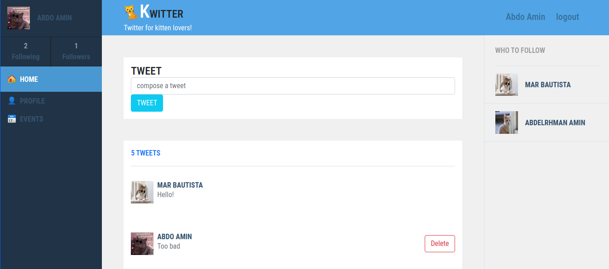
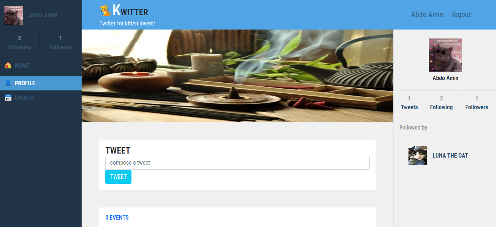
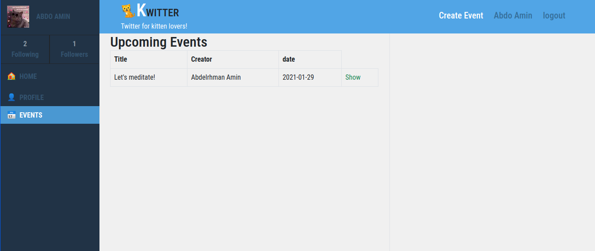
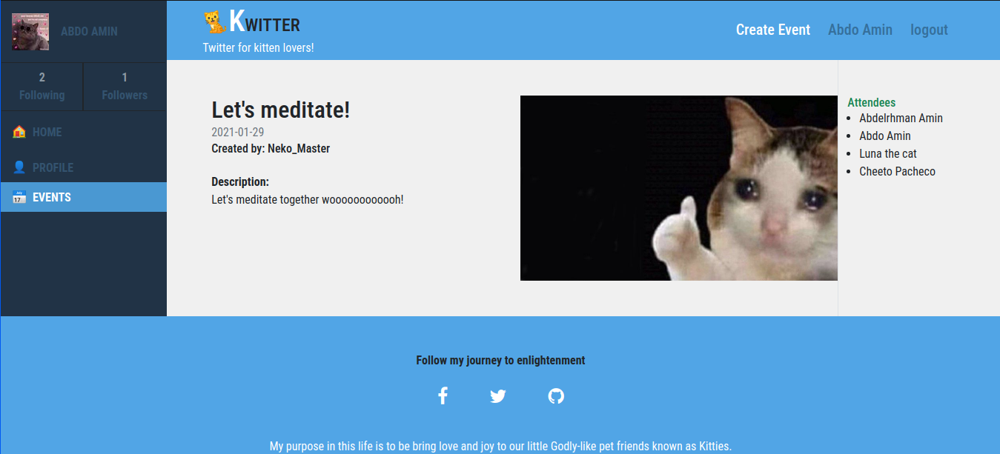
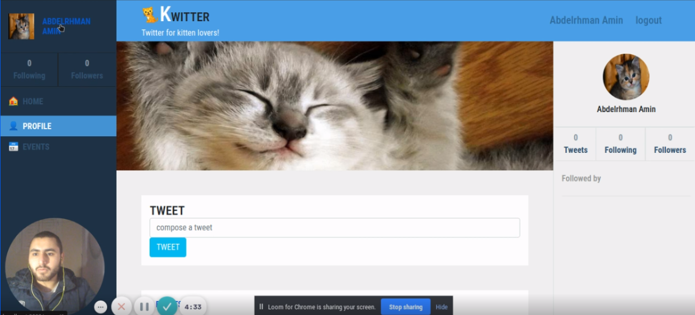

# Kwitter: twitter-redesign capstone project

> I did build a social media platform for kittens lovers so they can tweet, Create and attend events.
> The design is a clone of twitter.com with basic mocking of functionalities

1. The user logs in to the app, only by typing the username (a properly authenticated login is **not** a requirement).
2. The user is presented with the homepage that includes:
   1. Left-side menu (includes only links to pages that are implemented).
   2. _Tweets_ tab in the center (skip _Photos_ and _Videos_ for this MVP).
   3. Right-side section with *Who to follow (*skip _Trending for_ this MVP).
3. The _Tweets_ section includes:
   1. Simple form for creating a tweet.
   2. List of all tweets (sorted by most recent) that display tweet text and author details.
4. The _Who to follow_ section includes:
   1. a list of profiles that are not followed by the logged-in user (ordered by most recently added).
5. When the user opens the profile page, They can see:
   1. Left-side menu (includes only links to pages that are implemented).
   2. Cover picture and _Tweets_ tab in the center (skip other tabs and _Tweet to user_ form).
   3. Right-side section with _Profile detailed info._
6. The _Profile detailed info_ section includes:
   1. User photo.
   2. Button to follow a user.
   3. Stats: total number of tweets, number of followers, and number of following users.
   4. List of people who follow this user.
7. I've added features like creating an event with the ability to upload a picture and if not there is an auto default image to take place.
8. The user can assign an image and a cover for his profile and if he didn't, I did create an auto default image.

## Built With

- Ruby v2.6.5
- Ruby on Rails v6.0.3
- bootstrap gem
- fontawesome gem
- Gems used for testing: Capybara, Rspec-Rails, Shoulda-matchers

## Screenshots






## Video

[](https://www.loom.com/share/62ccab7024a84e2591e88c6905a6860a)

## Live Demo

[Heroku App Link](https://mysterious-citadel-12763.herokuapp.com/)

## Prerequisites

- Ruby: 2.5.7
- Rails: 6.0.3
- Postgres: >=9.5
- Git

## Usage

- Fork/Clone this project to your local machine
- Open folder in your local enviroment and run these lines of code to get started:

Open terminal and paste this line

```
   git clone https://github.com/AbdelrhmanAmin/Kwitter.git
```

go to the folder by writing this line

```
    cd Kwitter
```

Install gems with:

```Ruby
    bundle install
```

Setup database with:

```Ruby
   rails db:create
   rails db:migrate
```

Start server with:

```Ruby
    rails server
```

Open in your browser:

```
   http://localhost:3000/
```

## DIAGRAM

_(2).png?table=block&id=b7bf85fc-00ee-4a6b-a8e4-6326055bc282&width=1060&userId=&cache=v2>)

## Testing

bundle exec rspec

## Show your support

Give a ⭐️ if you like this project!

## Acknowledgments

- You can access all the design info (color, typography, layouts) in this link:

[Click here](https://www.behance.net/gallery/14286087/Twitter-Redesign-of-UI-details)

Design idea by [Gregoire Vella](https://www.behance.net/gregoirevella).
